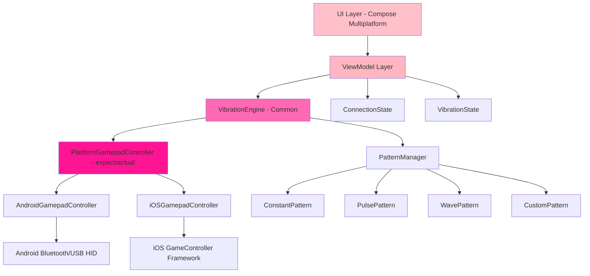

# Design Document: Gamepad Vibration Controller

## Overview

The Gamepad Vibration Controller is a Kotlin Multiplatform application that enables users to control vibration/haptic feedback on PlayStation (DualShock 4, DualSense) and Xbox controllers. The app provides multiple vibration modes (constant, pulse, wave, custom patterns), intensity controls, and a pink pastel-themed UI built with Compose Multiplatform and Material3. The architecture follows a clean separation between platform-agnostic UI/business logic and platform-specific gamepad communication layers, with Android supporting full Bluetooth/USB HID access and iOS limited to MFi-certified controllers due to Apple's restrictions.

The system is designed around a reactive state management pattern where the UI layer observes controller connection state and vibration status, while platform-specific implementations handle the low-level HID protocol communication. The design emphasizes extensibility for adding new controller types and vibration patterns while maintaining a consistent user experience across platforms.

## Architecture



### Architecture Layers

1. **UI Layer**: Compose Multiplatform screens with Material3 components, pink pastel theme
2. **ViewModel Layer**: State management, business logic coordination
3. **VibrationEngine**: Core vibration orchestration, pattern execution
4. **PlatformGamepadController**: Platform-specific gamepad communication (expect/actual pattern)
5. **PatternManager**: Vibration pattern algorithms and generators

## Main Algorithm/Workflow

```mermaid
sequenceDiagram
    participant User
    participant UI
    participant VM as ViewModel
    participant VE as VibrationEngine
    participant PGC as PlatformGamepadController
    participant Device as Gamepad Device
    
    User->>UI: Launch App
    UI->>VM: Initialize
    VM->>VE: Initialize VibrationEngine
    VE->>PGC: Start Controller Discovery
    PGC->>Device: Scan for Controllers
    Device-->>PGC: Controller Found
    PGC-->>VE: Controller Connected Event
    VE-->>VM: Update ConnectionState
    VM-->>UI: Display Connected Status
    
    User->>UI: Enable Vibration (Power Button)
    UI->>VM: SetVibrationEnabled(true)
    VM->>VE: EnableVibration()
    
    User->>UI: Select Pattern (e.g., Pulse)
    UI->>VM: SetPattern(PulsePattern)
    VM->>VE: SetPattern(PulsePattern, intensity=0.7)
    
    loop Pattern Execution
        VE->>VE: Calculate Next Frame
        VE->>PGC: SendVibrationCommand(leftMotor, rightMotor)
        PGC->>Device: HID Output Report
        Device-->>PGC: Acknowledgment
    end
    
    User->>UI: Disable Vibration
    UI->>VM: SetVibrationEnabled(false)
    VM->>VE: DisableVibration()
    VE->>PGC: SendVibrationCommand(0, 0)
    PGC->>Device: Stop Vibration


## Correctness Properties

*A property is a characteristic or behavior that should hold true across all valid executions of a system—essentially, a formal statement about what the system should do. Properties serve as the bridge between human-readable specifications and machine-verifiable correctness guarantees.*

### Property 1: Controller Connection State Updates

*For any* controller connection or disconnection event, the System SHALL update the ConnectionState and the UI_Layer SHALL display the corresponding status (connected or disconnected).

**Validates: Requirements 1.2, 1.3, 1.4**

### Property 2: Vibration Enable/Disable Commands

*For any* vibration enable or disable action, the ViewModel SHALL call the corresponding method (EnableVibration or DisableVibration) on the VibrationEngine.

**Validates: Requirements 2.1, 2.2**

### Property 3: Vibration Stop Command

*For any* state where vibration is disabled, the VibrationEngine SHALL send a vibration command with motor values of 0 to the PlatformGamepadController.

**Validates: Requirement 2.3**

### Property 4: Pattern Execution on Enable

*For any* currently selected VibrationPattern, when vibration is enabled, the System SHALL execute that pattern.

**Validates: Requirement 2.4**

### Property 5: Pattern Selection Command

*For any* vibration pattern and intensity value, when the user selects that pattern, the ViewModel SHALL call SetPattern on the VibrationEngine with the selected pattern and current intensity.

**Validates: Requirement 3.1**

### Property 6: Custom Pattern Support

*For any* valid custom pattern definition, the PatternManager SHALL support and execute that pattern.

**Validates: Requirement 3.5**

### Property 7: Pattern Selection State Update

*For any* pattern selection, the System SHALL update the VibrationState to reflect the newly active pattern.

**Validates: Requirement 3.6**

### Property 8: Intensity Update Command

*For any* valid intensity value between 0.0 and 1.0, when the user adjusts intensity, the ViewModel SHALL update the VibrationEngine with the new intensity value.

**Validates: Requirement 4.1**

### Property 9: Runtime Intensity Application

*For any* intensity change during active vibration, the VibrationEngine SHALL apply the new intensity to all subsequent vibration commands.

**Validates: Requirement 4.3**

### Property 10: Intensity Persistence Across Pattern Changes

*For any* intensity setting and pattern change, the intensity SHALL remain unchanged after the pattern change.

**Validates: Requirement 4.4**

### Property 11: Pattern Frame Calculation and Command Sending

*For any* active vibration pattern, the VibrationEngine SHALL calculate frame values for left and right motors and send vibration commands to the PlatformGamepadController.

**Validates: Requirements 5.1, 5.2**

### Property 12: Continuous Pattern Execution

*For any* vibration pattern, the VibrationEngine SHALL execute pattern frames continuously until vibration is explicitly disabled.

**Validates: Requirement 5.4**

### Property 13: HID Protocol Formatting

*For any* controller type and vibration command, the PlatformGamepadController SHALL format the command according to that controller's HID protocol specification.

**Validates: Requirement 6.4**

### Property 14: Protocol Abstraction

*For any* controller type, the VibrationEngine SHALL use the same interface to communicate with the PlatformGamepadController, regardless of controller-specific protocol differences.

**Validates: Requirement 6.5**

### Property 15: UI State Display

*For any* ConnectionState or VibrationState value, the UI_Layer SHALL display the correct corresponding status information.

**Validates: Requirements 7.4, 7.5**

### Property 16: Reactive UI Updates

*For any* state change in the ViewModel, the UI_Layer SHALL reactively update to reflect the new state.

**Validates: Requirement 7.9**

### Property 17: State Consistency Across Layers

*For any* operation that modifies state, the System SHALL maintain consistency between the ViewModel, VibrationEngine, and UI_Layer state representations.

**Validates: Requirements 8.3, 8.4, 8.5**

### Property 18: Connection Loss Recovery

*For any* active vibration state, when a controller connection is lost, the System SHALL update the ConnectionState and stop vibration attempts.

**Validates: Requirement 10.2**

### Property 19: Command Failure Resilience

*For any* vibration command failure, the System SHALL log the error and continue attempting subsequent commands without halting execution.

**Validates: Requirement 10.3**

### Property 20: Platform Error Translation

*For any* platform-specific error, the PlatformGamepadController SHALL translate it to a common error representation for the VibrationEngine.

**Validates: Requirement 10.5**
